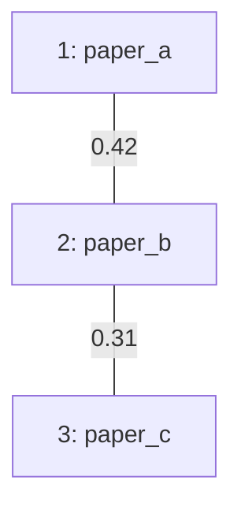

# paperbox

ローカルで完結する「論文・資料整理」CLI ツールです。

- PDF / DOCX / HTML / TXT からテキスト抽出（PDFは `pypdf` ベース）
- SQLite（FTS5）で全文検索
- 要約（ローカル簡易サマライザ）
- 文書間の共通点・差異（TF-IDF）
- 文書間の関係性を Mermaid で図式化（類似度グラフ）

> 目的：Codex app のテストとして、現実の作業に使える“最低限動く道具”を用意する

---

## セットアップ（venv推奨）

```bash
python -m venv .venv
source .venv/bin/activate  # Windowsなら .venv\Scripts\activate
pip install -U pip
pip install -e ".[dev]"
```

## Quick Start

```bash
# 1) init
paperbox init ./my_papers

# 2) ingest
paperbox ingest ./samples --project ./my_papers

# 3) search
paperbox search "causality AND system" --project ./my_papers --top 10

# 4) summarize
paperbox summarize 1 --project ./my_papers --sentences 8

# 5) compare
paperbox compare 1 2 --project ./my_papers --top-terms 18

# 6) graph
paperbox graph --project ./my_papers --threshold 0.25 --format mermaid > graph.md
```

## 使い方（最短）

```bash
# プロジェクト初期化（作業用フォルダ）
paperbox init ./my_papers

# 取り込み（単体ファイル or ディレクトリ）
paperbox ingest ./samples/paper1.pdf --project ./my_papers
paperbox ingest ./samples --project ./my_papers

# 一覧
paperbox list --project ./my_papers

# 全文検索
paperbox search "causality AND system" --project ./my_papers --top 10

# 要約
paperbox summarize 1 --project ./my_papers --sentences 8

# 比較
paperbox compare 1 2 --project ./my_papers --top-terms 18

# 関係性グラフ（Mermaid）
paperbox graph --project ./my_papers --threshold 0.25 --format mermaid > graph.md
```

---

## 出力の例（Mermaid）

`paperbox graph --format mermaid` は次のような内容を出します：



Markdownに貼れば図になります（GitHub / Notion / Obsidian など）。

---

## 注意（PDFの限界）

- 画像スキャンPDFは `pypdf` だけだと抽出できない場合があります  
  → OCR を入れたい場合は後で拡張（`pdf2image` + `pytesseract`）してください。

---

## ライセンス

MIT
